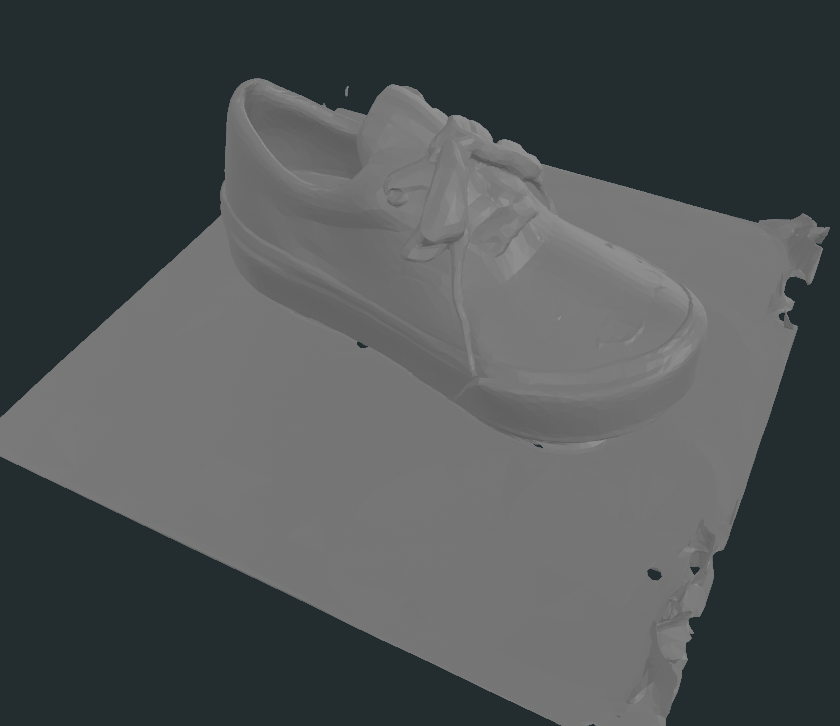
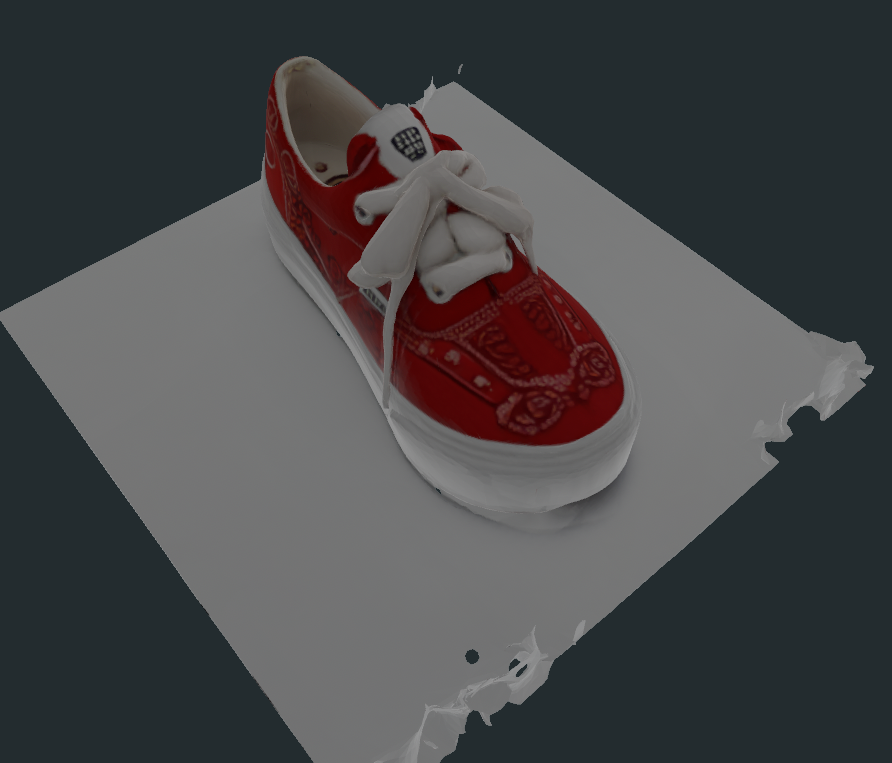

[English](README.md) | [한국어](README.ko.md)

# 3D 객체 재구성 API

최신 AI 모델을 사용하여 다중 시점 이미지를 고품질 3D 메시로 변환합니다. 6개의 RGB 이미지와 깊이 렌더를 업로드하면 품질 검증이 완료된 텍스처 메시를 받을 수 있습니다.

## 주요 기능

이 시스템은 두 가지 AI 재구성 모델(ReconViaGen과 nvdiffrec)을 실행하여 다중 시점 이미지에서 텍스처가 적용된 3D 메시를 생성합니다. 장시간 실행되는 추론 작업을 비동기로 처리하고, PSNR 및 SSIM 지표로 출력 품질을 검증하며, 여러 각도에서 미리보기 렌더를 제공합니다. REST API를 통해 작업을 제출하고, 상태를 폴링한 후, 메시, 텍스처, 미리보기 및 품질 보고서가 포함된 전체 결과를 다운로드할 수 있습니다.

## 예시 출력




## 사전 요구사항

이 시스템을 실행하기 전에 다음 사항을 확인하세요:

- **Docker** 및 **Docker Compose** 설치
- **NVIDIA GPU** 16GB+ VRAM (RTX 3090 이상 권장)
- **NVIDIA Container Toolkit** (nvidia-docker) GPU 패스스루용
- **~30GB 디스크 공간** 모델 가중치 및 출력물용
- **8GB+ 시스템 RAM** PyTorch 데이터 로딩용

## 빠른 시작

```bash
git clone https://github.com/hspark15429/3d-obj-rendering.git
cd 3d-obj-rendering
docker-compose up --build
```

**참고:** 첫 빌드 시 ~10GB의 모델 가중치(TRELLIS, nvdiffrec 체크포인트)를 다운로드합니다. 네트워크 속도에 따라 15-30분이 소요될 수 있습니다.

헬스 체크가 통과되면 API가 `http://localhost:8000`에서 사용 가능합니다.

## 사용법

### 1. 시스템 상태 확인

```bash
curl http://localhost:8000/health
```

예상 응답:
```json
{
  "status": "healthy",
  "gpu_available": true,
  "gpu_name": "NVIDIA GeForce RTX 3090",
  "vram_total": "24GB",
  "vram_free": "22GB"
}
```

### 2. 재구성 작업 제출

```bash
curl -X POST http://localhost:8000/jobs/ \
  -F "views=@input/multi_views/front.png" \
  -F "views=@input/multi_views/back.png" \
  -F "views=@input/multi_views/left.png" \
  -F "views=@input/multi_views/right.png" \
  -F "views=@input/multi_views/top.png" \
  -F "views=@input/multi_views/bottom.png" \
  -F "depth_renders=@input/depth_renders/front.png" \
  -F "depth_renders=@input/depth_renders/back.png" \
  -F "depth_renders=@input/depth_renders/left.png" \
  -F "depth_renders=@input/depth_renders/right.png" \
  -F "depth_renders=@input/depth_renders/top.png" \
  -F "depth_renders=@input/depth_renders/bottom.png" \
  -F "model=reconviagen"
```

응답:
```json
{
  "job_id": "abc123def456",
  "status": "PENDING",
  "message": "Job submitted successfully"
}
```

**모델 옵션:**
- `reconviagen` - TRELLIS-VGGT 모델 (빠름, 일반 객체에 적합)
- `nvdiffrec` - nvdiffrec 미분 렌더러 (느림, 고품질)

### 3. 작업 상태 확인

```bash
curl http://localhost:8000/jobs/abc123def456
```

응답 (진행 중):
```json
{
  "job_id": "abc123def456",
  "status": "PROGRESS",
  "progress": 45,
  "step": "Mesh generation",
  "model": "reconviagen"
}
```

응답 (완료):
```json
{
  "job_id": "abc123def456",
  "status": "SUCCESS",
  "progress": 100,
  "result": {
    "mesh_path": "storage/jobs/abc123def456/output/mesh.obj",
    "preview_paths": [
      "storage/jobs/abc123def456/output/preview_0.png",
      "storage/jobs/abc123def456/output/preview_1.png",
      "storage/jobs/abc123def456/output/preview_2.png"
    ],
    "quality": {
      "status": "normal",
      "psnr": 28.5,
      "ssim": 0.92
    }
  }
}
```

### 4. 결과 다운로드

```bash
curl http://localhost:8000/jobs/abc123def456/download -o results.zip
```

ZIP 파일에 포함된 내용:
- `mesh.obj` - 3D 메시 지오메트리
- `material.mtl` - 재질 정의
- `texture_*.png` - 텍스처 이미지
- `preview_*.png` - 다중 각도 미리보기 렌더
- `quality.json` - 품질 지표 및 상태

### 작업 취소

```bash
# 취소 요청 (2단계 프로세스)
curl -X POST http://localhost:8000/jobs/abc123def456/cancel

# 취소 확인
curl -X POST http://localhost:8000/jobs/abc123def456/cancel \
  -H "Content-Type: application/json" \
  -d '{"confirm": true}'
```

## API 레퍼런스

전체 엔드포인트 문서는 **[docs/API.md](docs/API.md)**를 참조하세요.

주요 엔드포인트:
- `GET /health` - 시스템 상태 및 GPU 상태
- `POST /jobs` - 재구성 작업 제출
- `GET /jobs/{job_id}` - 작업 상태 폴링
- `POST /jobs/{job_id}/cancel` - 실행 중인 작업 취소
- `GET /jobs/{job_id}/download` - 결과 ZIP 다운로드

전체 오류 코드 참조(17개 코드)는 API 문서에서 확인할 수 있습니다.

## 아키텍처

이 시스템은 다음을 사용합니다:
- **FastAPI** - REST API용
- **Celery** - 비동기 작업 큐 (장시간 실행 모델 추론 처리)
- **Redis** - 메시지 브로커 및 상태 저장소
- **ReconViaGen** (TRELLIS-VGGT) - 신경망 재구성
- **nvdiffrec** - 미분 렌더링 정제

자세한 아키텍처 다이어그램 및 설계 결정은 **[docs/architecture.md](docs/architecture.md)**를 참조하세요.

## 입력 형식

시스템에서 요구하는 입력:

**다중 시점 RGB 이미지** (`multi_views/`):
- 6개의 PNG 이미지: `front.png`, `back.png`, `left.png`, `right.png`, `top.png`, `bottom.png`
- 해상도: 2048x2048 픽셀
- 형식: RGB PNG
- 카메라: 직교 축에서의 원근 투영

**깊이 렌더** (`depth_renders/`):
- 다중 시점 이름과 일치하는 6개의 그레이스케일 PNG 이미지
- 해상도: 1024x1024 픽셀
- 형식: 그레이스케일 PNG (깊이가 밝기로 인코딩됨)

예시 입력 파일은 `input/multi_views/` 및 `input/depth_renders/`에서 제공됩니다.

## 출력 형식

각 완료된 작업에서 생성되는 출력:

**3D 메시:**
- `mesh.obj` - Wavefront OBJ 지오메트리 파일
- `material.mtl` - 텍스처 참조가 포함된 재질 정의
- 선택사항: `mesh.glb` (웹 뷰어용 GLB 형식)

**텍스처:**
- `texture_kd.png` - 디퓨즈 컬러 텍스처
- `texture_ks.png` - 스펙큘러 텍스처 (사용 가능한 경우)
- `texture_normal.png` - 노말 맵 (사용 가능한 경우)

**미리보기 이미지:**
- `preview_0.png` ~ `preview_7.png` - 45도 간격으로 렌더링된 8개의 뷰
- 해상도: 512x512 픽셀
- 텍스처와 와이어프레임 오버레이가 적용된 메시 표시

**품질 보고서:**
- `quality.json` - 포함 내용:
  - `status`: "normal", "warning", 또는 "failure"
  - `psnr`: 최대 신호 대 잡음비 (dB)
  - `ssim`: 구조적 유사성 지수 (0-1)
  - `psnr_expected`: 현재 상태의 임계값
  - `ssim_expected`: 현재 상태의 임계값

**품질 임계값:**
- **Normal**: PSNR ≥ 25dB AND SSIM ≥ 0.85
- **Warning**: PSNR ≥ 20dB AND SSIM ≥ 0.75
- **Failure**: PSNR < 20dB OR SSIM < 0.75

## 개발

### 테스트 실행

```bash
# 모든 테스트 실행
docker-compose exec api pytest

# 상세 출력으로 실행
docker-compose exec api pytest -v

# 특정 테스트 파일 실행
docker-compose exec api pytest app/tests/test_validation.py
```

### 로그 보기

```bash
# 모든 서비스 로그 팔로우
docker-compose logs -f

# API 로그만
docker-compose logs -f api

# Worker 로그만
docker-compose logs -f worker
```

### 문제 해결

**GPU가 감지되지 않는 경우:**
```bash
# nvidia-docker 설치 확인
docker run --rm --gpus all nvidia/cuda:12.1.1-base-ubuntu22.04 nvidia-smi

# GPU 할당 확인
docker-compose exec api nvidia-smi
```

**메모리 부족 오류:**
- `docker-compose.yml`에서 동시 작업자 수 줄이기 (기본값: 1)
- 다른 GPU 프로세스가 실행 중이지 않은지 확인
- 16GB+ VRAM 사용 가능 여부 확인

**첫 실행이 느린 경우:**
- 첫 빌드 시 모델 가중치 (~10GB) 다운로드
- nvdiffrast용 CUDA 컴파일에 5-10분 소요
- 이후 시작은 빠름 (<30초)

## 라이선스

이 프로젝트는 취업 지원을 위한 기술 과제로 개발되었습니다. 평가 및 참조 목적으로 사용하세요.

## 인용

이 시스템을 사용하는 경우, 기반 모델을 인용해 주세요:

**TRELLIS (ReconViaGen):**
```
@article{trellis2024,
  title={TRELLIS: Scalable Text-to-3D with Triplane Latent Diffusion},
  author={...},
  journal={arXiv preprint},
  year={2024}
}
```

**nvdiffrec:**
```
@article{munkberg2022nvdiffrec,
  title={Extracting Triangular 3D Models, Materials, and Lighting From Images},
  author={Munkberg, Jacob and Hasselgren, Jon and Shen, Tianchang and Gao, Jun and Chen, Wenzheng and Evans, Alex and M{\"u}ller, Thomas and Fidler, Sanja},
  journal={CVPR},
  year={2022}
}
```
