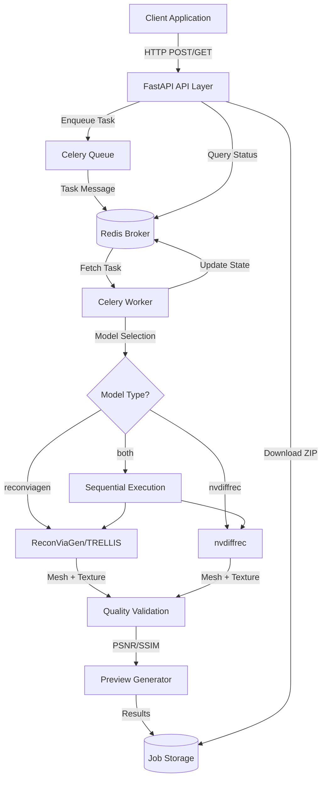
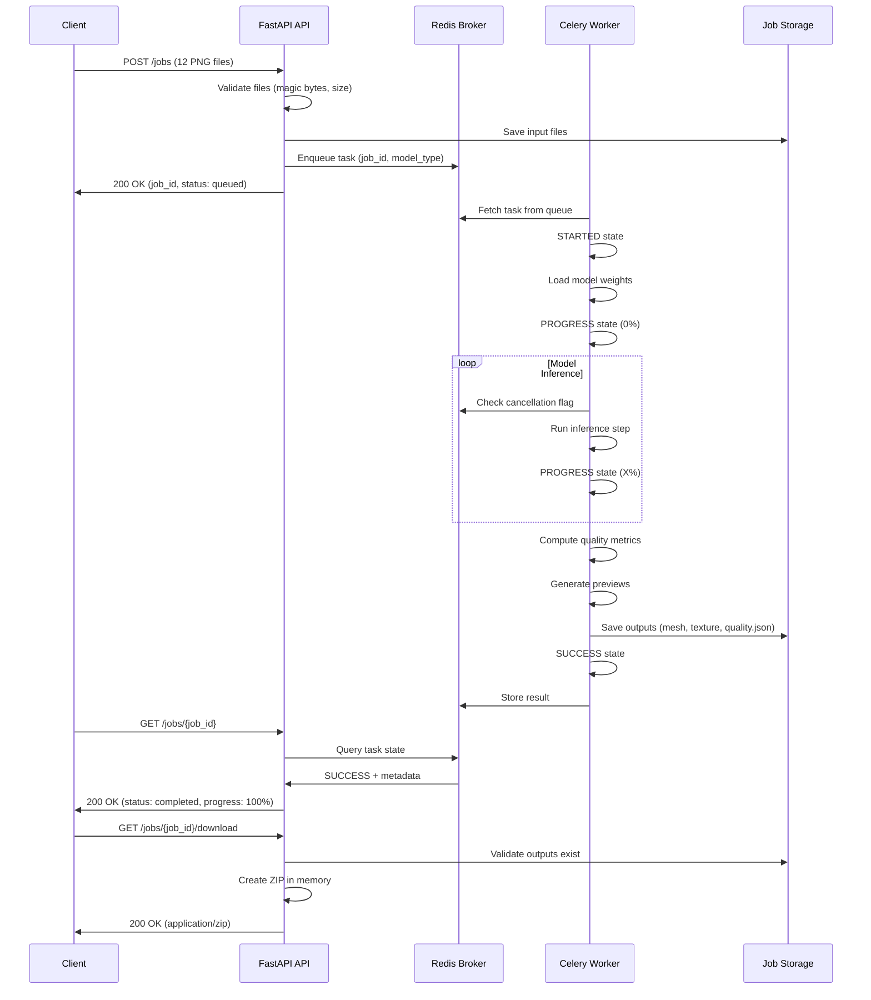
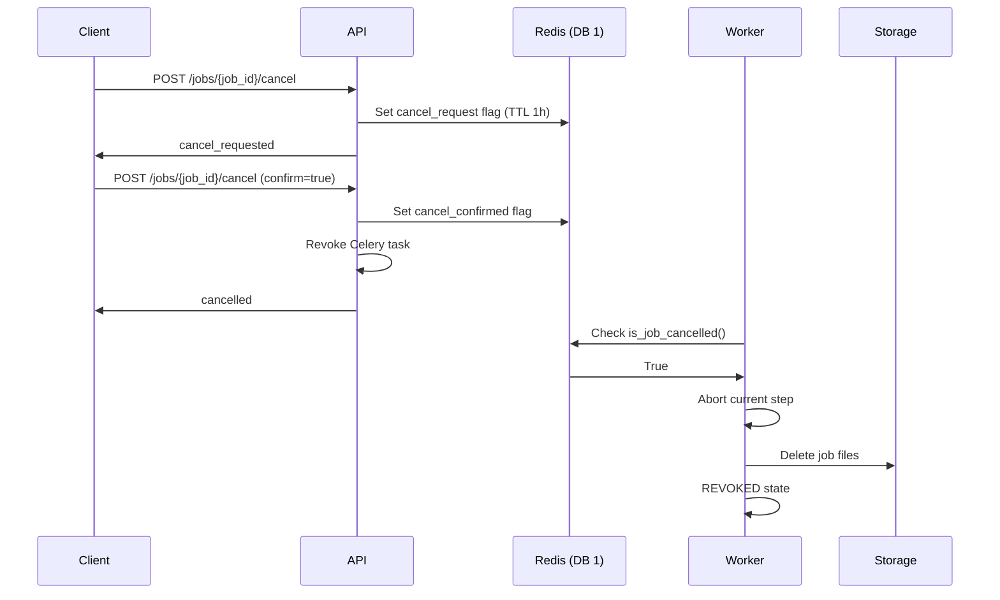

# System Architecture

## Overview

This 3D reconstruction system converts multi-view images into high-quality textured 3D meshes using state-of-the-art neural rendering models. The system is built as an asynchronous API service that can process long-running GPU inference tasks while providing real-time status updates.

**Key Features:**
- Dual model support: ReconViaGen (TRELLIS-VGGT) and nvdiffrec
- Asynchronous task processing with progress tracking
- Quality validation via PSNR/SSIM metrics
- Comprehensive error handling with 17 structured error codes
- Two-step cancellation for long-running jobs
- Docker-based deployment with GPU support

## High-Level Architecture

The system follows a service-oriented architecture with clear separation between API, task queue, and worker components:



## Component Details

### FastAPI API Layer

**Files:** `app/main.py`, `app/api/jobs.py`, `app/api/schemas.py`

The API layer handles client requests and provides synchronous HTTP endpoints:

- **Lifespan management:** GPU validation at startup ensures minimum 12GB VRAM available
- **Structured error responses:** All errors follow consistent JSON format with error codes, messages, details, and suggestions
- **File validation:** Multi-part form upload with PNG magic byte validation and size limits (20MB per file, 200MB total)
- **Job submission:** Generates 8-character human-friendly job IDs (nanoid), saves files to storage, enqueues Celery task
- **Status polling:** Maps Celery states (PENDING, STARTED, PROGRESS, SUCCESS, FAILURE, REVOKED) to job statuses
- **Result download:** Creates in-memory ZIP with compression level 6, includes meshes, textures, previews, quality.json

**Endpoints:**
- `GET /health` - GPU status and memory info
- `POST /jobs` - Submit reconstruction job
- `GET /jobs/{job_id}` - Get job status with progress
- `POST /jobs/{job_id}/cancel` - Two-step cancellation
- `GET /jobs/{job_id}/download` - Download results ZIP

### Celery Async Queue

**Files:** `app/celery_app.py`, `app/tasks/reconstruction.py`

Asynchronous task processing with long-running model inference:

- **Factory pattern:** Avoids circular imports via `create_celery_app()` and `@shared_task` decorator
- **Extended timeouts:** 4-hour visibility timeout for broker (model inference can take minutes to hours)
- **Fair distribution:** `prefetch_multiplier=1` ensures one task per worker (prevents resource contention on GPU)
- **Task tracking:** `task_track_started=True` enables STARTED state for immediate feedback
- **Soft/hard time limits:** 2-hour soft limit for 'both' mode (7200s soft, 7500s hard)
- **Cancellation checkpoints:** Workers check `is_job_cancelled()` before each major step (load weights, inference, quality)

**Task flow:**
1. Validate input files exist
2. Create camera transforms JSON
3. For each selected model:
   - Check cancellation
   - Load model weights
   - Run inference (produces GLB, OBJ, PLY meshes)
   - Compute quality metrics (PSNR/SSIM)
   - Generate previews (textured + wireframe)
   - Cleanup VRAM before next model
4. Return outputs dict with mesh paths, quality reports, preview paths

### Redis Broker

**Files:** `docker-compose.yml` (Redis service configuration)

Dual Redis database architecture for separation of concerns:

- **DB 0:** Celery broker and results backend
  - Task messages and state
  - Result storage with TTL
  - High write throughput
- **DB 1:** Application state database
  - Cancellation flags (pending and confirmed)
  - 1-hour TTL for automatic cleanup
  - Accessed via `app/services/job_manager.py`

**Why Redis:**
- Battle-tested message broker
- Built-in result backend
- Fast in-memory operations
- Simple deployment (single Docker service)

### Model Workers

**Files:** `app/models/reconviagen.py`, `app/models/nvdiffrec.py`, `app/models/base.py`

Neural rendering models for 3D reconstruction:

#### ReconViaGen (TRELLIS-VGGT)
- **Architecture:** Vision-geometry-guided transformer with SLAT decoder
- **Input:** 6 multi-view PNG images
- **Output:** GLB mesh with baked textures, OBJ/PLY conversions
- **VRAM:** ~14-16GB during inference
- **Key features:**
  - Sparse convolutions via spconv-cu120
  - Flash attention for memory efficiency
  - Gaussian splatting renderer for preview
  - Postprocessing utilities handle texture baking

#### nvdiffrec
- **Architecture:** Differentiable renderer with learnable geometry
- **Input:** 6 multi-view PNGs + 6 depth renders
- **Output:** Textured mesh (OBJ/PLY/GLB)
- **Iterations:** 500 default (configurable)
- **Key features:**
  - SimpleGeometry deformable sphere (when DMTet unavailable)
  - nvdiffrast for differentiable rasterization
  - Spherical UV mapping for texture generation
  - Fallback point splatting renderer

#### Sequential Execution ('both' mode)
When `model_type='both'`:
1. Run ReconViaGen first
2. Cleanup GPU VRAM completely
3. Run nvdiffrec
4. Return results from both models

Prevents VRAM exhaustion by cleaning between models.

### Services Layer

**Files:** `app/services/` directory

Shared utilities for file handling, quality validation, preview generation, and job management:

- **file_handler.py:** Upload validation, storage management, PNG magic byte verification
- **quality_metrics.py:** PSNR/SSIM computation with configurable thresholds
  - Normal: PSNR ≥ 25dB AND SSIM ≥ 0.85
  - Warning: PSNR ≥ 20dB AND SSIM ≥ 0.75
  - Failure: Below warning thresholds
- **preview_generator.py:** Mesh rendering for textured + wireframe previews
  - RasterizeCudaContext for GPU rendering (GL fallback)
  - Vertical flip for OpenGL convention
  - Edge overlay via PIL ImageDraw
- **job_manager.py:** Two-step cancellation with Redis flags
- **vram_manager.py:** GPU memory cleanup via `torch.cuda.empty_cache()`
- **result_packager.py:** In-memory ZIP creation with validation

## Key Decisions

| Decision | Options Considered | Rationale |
|----------|-------------------|-----------|
| Async queue over sync API | (1) Synchronous HTTP with long timeout<br>(2) Async queue with polling | Model inference takes minutes to hours. Sync would require connection kept open, prone to timeouts. Queue enables status polling and resilient reconnection. |
| CUDA 12.1 + PyTorch 2.4.1 | (1) CUDA 11.8 (broader compatibility)<br>(2) CUDA 12.1 (ReconViaGen requirement) | TRELLIS requires spconv-cu120, which needs CUDA 12.1. PyTorch 2.4.1 is latest stable with cu121 wheels. |
| Celery + Redis | (1) RabbitMQ + Celery<br>(2) Redis + Celery<br>(3) Cloud queue (AWS SQS) | Redis provides both broker and state storage in single service. Battle-tested, simple Docker deployment. No external dependencies. |
| Two-step cancellation | (1) Immediate cancellation<br>(2) Two-step confirmation | Long-running jobs (hours) risk accidental cancellation. Two-step (request → confirm) prevents mistakes while allowing intentional abort. |
| Static previews over video | (1) Video preview (MP4 rotation)<br>(2) Static multi-view images | Simpler to implement and debug. Meets requirement for visual validation. No video encoding overhead. |
| Dual Redis databases | (1) Single database for everything<br>(2) Separate databases for Celery/state | Separation of concerns: DB 0 for Celery internals, DB 1 for app state. Different TTL requirements. Clear boundaries. |
| 17 structured error codes | (1) Generic error messages<br>(2) HTTP status only<br>(3) Detailed error taxonomy | Users need actionable guidance. Error codes enable client-side handling, suggestions provide fixes. Covers validation, state, model, and resource errors. |
| In-memory ZIP creation | (1) Write ZIP to disk, stream file<br>(2) Create ZIP in memory | Avoids disk I/O and cleanup. Simpler code with BytesIO. ZIP_DEFLATED compression level 6 balances size/speed. |
| Sequential execution for 'both' | (1) Parallel model execution<br>(2) Sequential with VRAM cleanup | Each model needs 14-16GB VRAM. Parallel would exceed GPU memory. Sequential with explicit cleanup prevents OOM. |
| GPU validation at startup | (1) Lazy validation on first job<br>(2) Startup validation with fail-fast | Fail-fast prevents queueing jobs that can't run. 12GB minimum ensures both models can execute. Clear error at startup vs cryptic runtime failures. |

## Data Flow

Complete job lifecycle from submission to download:



**Cancellation Flow:**



## Deployment

### Production Considerations

**Hardware Requirements:**
- NVIDIA GPU with 16GB+ VRAM (e.g., RTX 4090, A6000, V100)
- 8GB shared memory (`/dev/shm`) for PyTorch DataLoader
- 32GB+ system RAM
- 100GB+ disk space for model weights and job storage

**Scaling Options:**

1. **Vertical scaling (single machine):**
   - Increase worker concurrency (one worker per GPU)
   - Use larger GPU (24GB/32GB VRAM)
   - Add more GPUs with `NVIDIA_VISIBLE_DEVICES`

2. **Horizontal scaling (multiple machines):**
   - Deploy multiple worker containers across machines
   - Point all workers to same Redis broker
   - Shared NFS/S3 for job storage
   - Load balancer for API containers

**Monitoring:**

- Health endpoint: `GET /health` for GPU status and memory
- Celery Flower for task monitoring: `celery -A app.celery_app flower`
- Redis CLI for queue depth: `redis-cli llen celery`
- Docker logs for error tracking: `docker compose logs -f worker`

**Resource Management:**

- Use `docker compose` resource limits to cap GPU memory
- Set Celery `worker_max_tasks_per_child` to prevent memory leaks
- Implement job TTL for automatic cleanup (future enhancement)
- Monitor disk space for job storage volume

**Environment Variables:**

```bash
# Redis connection
CELERY_BROKER_URL=redis://redis:6379/0
CELERY_RESULT_BACKEND=redis://redis:6379/0
REDIS_STATE_DB=redis://redis:6379/1

# Storage paths
JOB_STORAGE_PATH=/app/storage/jobs

# GPU selection
NVIDIA_VISIBLE_DEVICES=0  # Single GPU
NVIDIA_VISIBLE_DEVICES=0,1  # Multi-GPU

# Logging
LOG_LEVEL=INFO
```

**Security Considerations:**

- No authentication implemented (out of scope for demo)
- File validation prevents malicious uploads
- Error messages sanitized (no internal paths exposed)
- Rate limiting recommended for production (nginx/traefik)
- CORS configuration if web frontend needed

**Backup and Recovery:**

- Job storage volume: Regular snapshots
- Model weights volume: Versioned backups
- Redis: Persistence enabled (RDB snapshots)
- Application code: Git-based deployment

**Performance Tuning:**

- Celery visibility timeout: Adjust based on job duration
- Redis maxmemory policy: `allkeys-lru` for TTL expiration
- Shared memory size: Match DataLoader worker count
- Worker concurrency: One worker per GPU for optimal throughput

**Docker Compose Production Settings:**

```yaml
services:
  worker:
    deploy:
      replicas: 2  # Scale workers
      resources:
        limits:
          memory: 32G
        reservations:
          memory: 16G
          devices:
            - capabilities: [gpu]
    restart: unless-stopped
    logging:
      driver: "json-file"
      options:
        max-size: "10m"
        max-file: "3"
```

## Future Enhancements

- Authentication and authorization (JWT tokens)
- Job TTL with automatic cleanup
- Webhook notifications for job completion
- Multi-GPU parallelism for 'both' mode
- Real-time progress via WebSocket
- S3 storage backend for job files
- Prometheus metrics export
- Rate limiting per client
